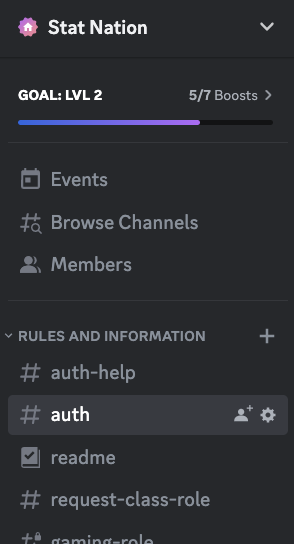
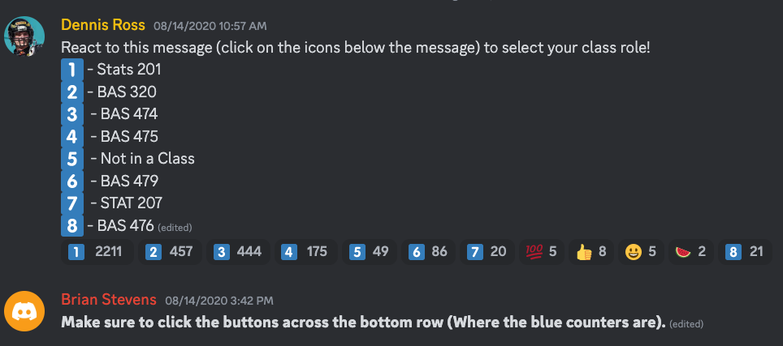
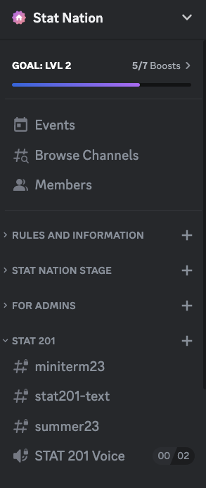

# Joining Stat Nation Discord

Discord is a communication tool with many UTK faculty and students around to help things out.

1. [Click here to join](https://discord.gg/b6ZZrtNVub)
2. Verify your UTK email
   1. Go to the [#auth](https://discord.com/channels/715538203716878338/876126440012255232) "channel"
      * 
   2. In the [#auth](https://discord.com/channels/715538203716878338/876126440012255232) channel, send a message like: `?auth yournetID`
      *  Example: if your email is `aspannba@utk.edu` your message should be `?auth aspannba`
   3. Receive an email from the discord with a verification code
      * Make sure to check spam folder if you don't see an email!
   4. Back in the [#auth](https://discord.com/channels/715538203716878338/876126440012255232) channel, type `?verify yourverificationcode`
      * Example: if the email said you code was 3456789 your message should be `?verify 3456789`
3. Join your class's channel(s)!
   1. Go to the [#request-class-role](https://discord.com/channels/715538203716878338/715566787118235730) channel
   2. Click on the reaction that corresponds to your class (image below)
      * Example:
        * If I wanted to join Stats 201 channels I would click the :one: that appears below Dennis's message.  
        * In the below screenshot, the :one: you should click has the number 2211 beside it, you'll see this number increase when you click it. 
        * DO NOT click the :one: that has - Stats 201 beside it, that will do nothing.
      * 
      * To leave a class you can click on the same button again to have the channels disappear
4. Done! Explore and engage!
   * Once you've completed step 3 you should see your class's channels appear in the side bar
   * 
